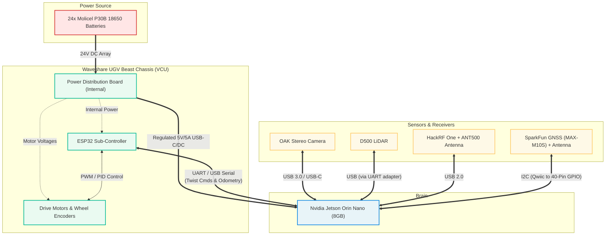

# Intelligent Dynamic Spectrum Cartography: Motion Planning

## Overview
This repository contains the autonomous motion planning and hardware control stack for the **Intelligent Dynamic Spectrum Cartography** project, sponsored by the DEVCOM Army Research Laboratory. It coordinates a multi-agent system consisting of a primary Unmanned Ground Vehicle (UGV) and an adversarial OPFOR unit to track, locate, and map RF emitters in dynamic combat environments.

Instead of exhaustive physical sensing, this system utilizes the ROS 2 `Nav2` stack integrated with a custom RF Exploration Node. The UGV autonomously samples sparse RF data, passes it to an onboard neural network for spectrum map reconstruction, and dynamically updates its pathfinding goals to sample regions of highest uncertainty.

## System Architecture

### 1. Primary UGV (Waveshare UGV Beast)
The primary agent utilizes a dual-compute architecture:
* **High-Level Compute (Nvidia Jetson Orin Nano 8GB):** Runs ROS 2, processes sensor point-clouds, handles the HackRF SDR data streams, runs the PartialConvMAE inference, and executes the `Nav2` spatial planning.
* **Low-Level VCU (ESP32):** Receives `cmd_vel` Twist messages via USB Serial. Manages differential drive kinematics, motor PID loops, and streams wheel odometry back to the Jetson.

**Perception Payload:**
* **D500 LiDAR & OAK Stereo Camera:** 2D/3D environmental mapping and obstacle avoidance.
* **HackRF One (w/ ANT500):** Software-defined radio for sparse RF signal collection.
* **SparkFun MAX-M10S GNSS:** Global positioning via I2C to the Jetson GPIO.

### 2. OPFOR Emitter (Hiwonder Tank Chassis)
The OPFOR unit acts as an adversarial, mobile RF emitter

